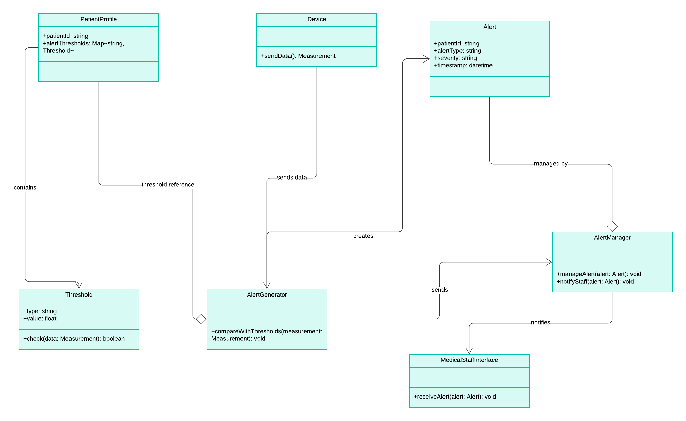
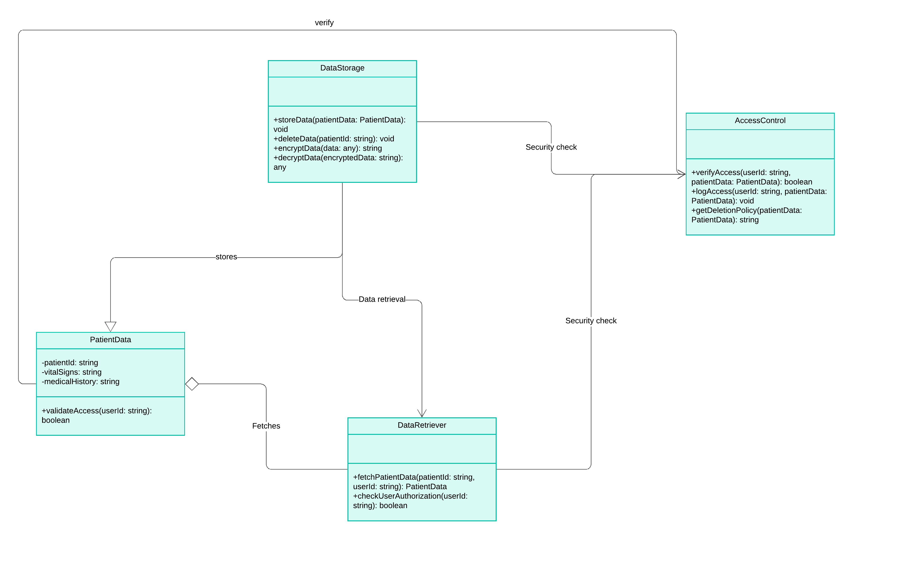
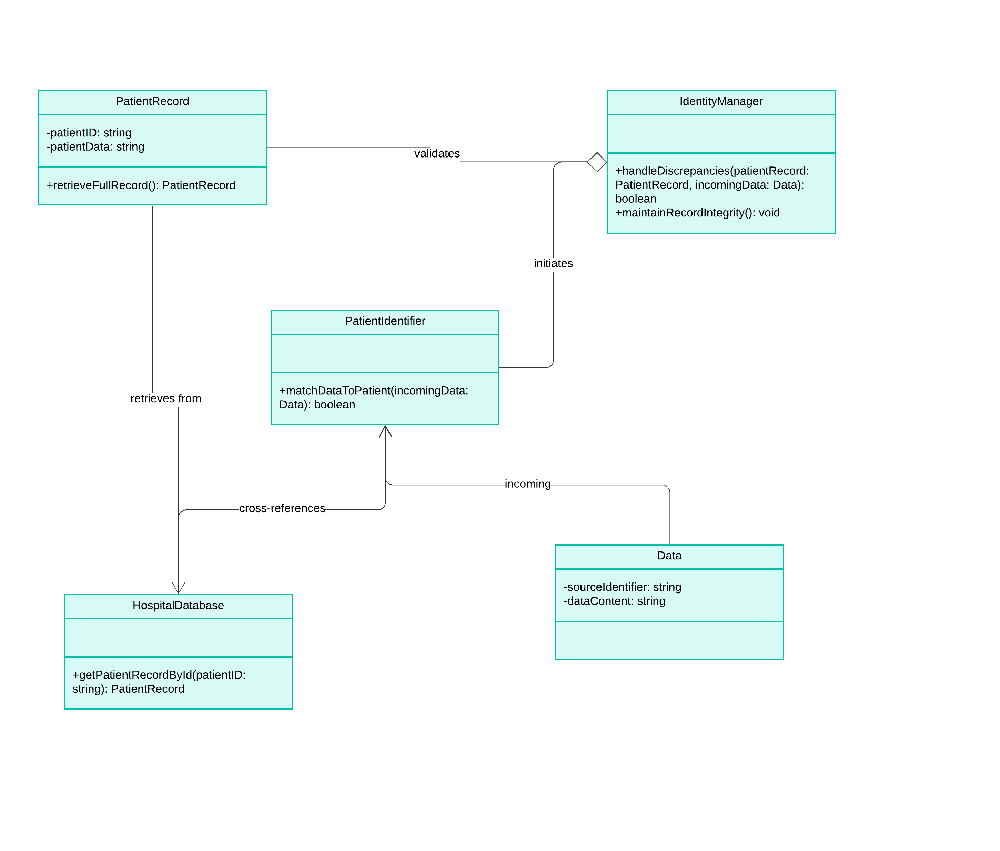
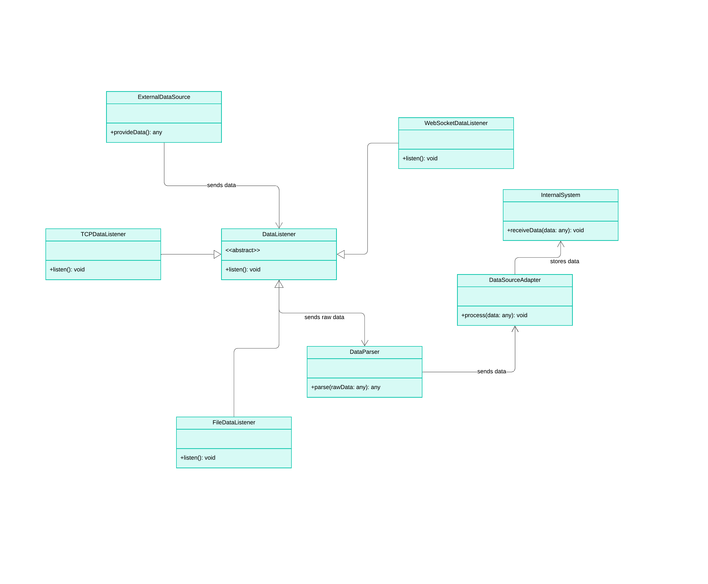

# Cardio Data Simulator

The Cardio Data Simulator is a Java-based application designed to simulate real-time cardiovascular data for multiple patients. This tool is particularly useful for educational purposes, enabling students to interact with real-time data streams of ECG, blood pressure, blood saturation, and other cardiovascular signals.

## Features

- Simulate real-time ECG, blood pressure, blood saturation, and blood levels data.
- Supports multiple output strategies:
  - Console output for direct observation.
  - File output for data persistence.
  - WebSocket and TCP output for networked data streaming.
- Configurable patient count and data generation rate.
- Randomized patient ID assignment for simulated data diversity.

## Getting Started

### Prerequisites

- Java JDK 11 or newer.
- Maven for managing dependencies and compiling the application.

### UML Diagram

The following UML diagram illustrates the class structure of the Cardio Data Simulator:

## Alert Generation System:

This diagram shows a services where a devices continuously send data to the system.
The system will then go through the alertGenerator 
to check if the data is normal or not based on the patient profile and a threshold.
If the data is not normal, the system will send an alert to the alertManager.
Which will then send the alert to the staff.

## Data Storage System:

With this diagram, the system will store the data in the database.
The data is saved in DataStorage, it stores data by retrieving the data from PatientData using DataRetriever.
The data is then saved in the database using DataSaver.
During the process, the system will do security to ensure the data is safe. 
Limiting the access to the data.

## Patient Identification System:

This diagram shows the system where the patient is identified.
The data received from the devices has to be identified to the correct patient.
The system will Identify the patient by sending the data to,
IdentityManager which will then send the data to the PatientIdentification and the HospitalDatabase.
The IdentityManager will then send the data to PatientRecord to compare the data with the patient data in the database.
The data is then cross-referenced with the data in the HospitalDatabase to ensure the data is correct.

## Data Access Layer:

This diagram shows the system where the data is received and handled.
The dataListener receives constant data from four different sources:
- TCP
- External Source
- Files
- WebSocket

The data is sent Raw to the Data Parser to be parsed.
The DataSourceAdapter then converts the data to the correct format to then be stored in the internalSystem.

## License

This project is licensed under the MIT License—see the [LICENSE](LICENSE) file for details.

## Project Members
- Student ID: i6349778
- Student ID: i6341767
